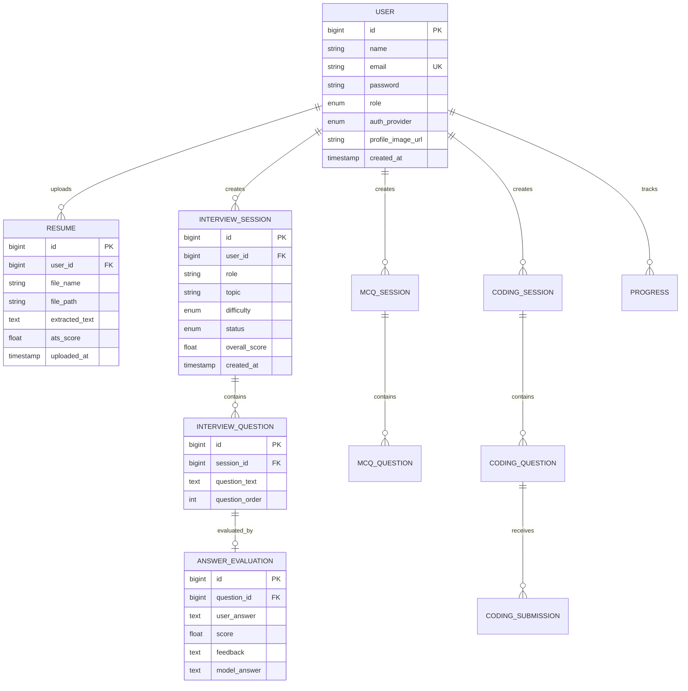

<p align="center">
  
</p>

<h1 align="center">VelloxPrep</h1>
<p align="center">
  <strong>AI-Powered Interview Preparation & Career Intelligence Platform</strong>
</p>

<p align="center">
  
  
  
  
  
</p>

<p align="center">
  <a href="#-features">Features</a> •
  <a href="#️-architecture">Architecture</a> •
  <a href="#-quick-start">Quick Start</a> •
  <a href="#-api-reference">API Reference</a> •
  <a href="#-project-structure">Project Structure</a> •
  <a href="#-deployment">Deployment</a>
</p>

---

## 📋 Table of Contents

- [Overview](#-overview)
- [Features](#-features)
- [Architecture](#️-architecture)
- [Technology Stack](#-technology-stack)
- [Quick Start](#-quick-start)
  - [Prerequisites](#prerequisites)
  - [Environment Setup](#environment-setup)
  - [Running Locally](#running-locally)
- [API Reference](#-api-reference)
  - [Authentication](#authentication)
  - [User Management](#user-management)
  - [Resume Management](#resume-management)
  - [Interview Engine](#interview-engine)
  - [MCQ Engine](#mcq-engine)
  - [Coding Test Engine](#coding-test-engine)
  - [Dashboard & Analytics](#dashboard--analytics)
  - [Admin Console](#admin-console)
- [Project Structure](#-project-structure)
- [Database Schema](#️-database-schema)
- [Security](#-security)
- [Frontend Architecture](#-frontend-architecture)
- [Performance Optimizations](#-performance-optimizations)
- [Deployment](#-deployment)
- [Contributing](#-contributing)
- [License](#-license)

---

## 🌟 Overview

**VelloxPrep** is a full-stack, production-grade interview preparation platform that leverages Google's **Gemini AI** to deliver a premium, personalized career coaching experience. The platform generates tailored interview questions, evaluates answers with AI-powered feedback, conducts resume analysis with ATS scoring, and provides real-time performance analytics — all wrapped in a stunning, glassmorphic dark-mode interface.

Built for candidates preparing for software engineering, data science, product management, and other technical roles, VelloxPrep transforms passive studying into an active, intelligent interview simulation experience.

---

## ✨ Features

### 🎯 Core Capabilities

| Feature | Description |
|---|---|
| **AI Interview Generation** | Generates role-specific, difficulty-calibrated interview questions using Gemini AI |
| **Resume-Based Interviews** | Parses uploaded resumes and generates targeted questions based on candidate experience |
| **Real-Time Answer Evaluation** | AI evaluates each answer on accuracy, depth, communication, and provides improvement tips |
| **MCQ Assessment Engine** | Multiple-choice quiz sessions with instant grading and detailed explanations |
| **Mock Coding Tests** | Timed coding challenges with AI-powered code evaluation and test case validation |
| **Resume Management** | Upload, parse, and manage multiple resumes with PDF text extraction |
| **ATS Score Analysis** | AI scores resumes against job descriptions with actionable improvement suggestions |
| **Performance Dashboard** | Real-time analytics with score trends, session history, and progress tracking |
| **Admin Console** | Platform-wide statistics, user management, role promotion/demotion, and audit controls |

### 🎨 Design & UX

| Feature | Description |
|---|---|
| **Neural Canvas Background** | Animated particle network with parallax depth and synaptic pulse effects |
| **Glassmorphism UI** | Frosted-glass panels, gradient borders, and ambient glow effects |
| **Dark/Light Theme** | Full theme switching with persisted user preference |
| **Responsive Layout** | Fluid grid system optimized for desktop, tablet, and mobile viewports |
| **Micro-Animations** | Hover effects, scroll reveals, card spotlights, and cursor glow followers |
| **Mobile Performance Engine** | Adaptive rendering with reduced particles, 1x DPR, and touch-device bypass |

### 🔐 Security

| Feature | Description |
|---|---|
| **JWT Authentication** | Stateless token-based auth with 24h access tokens and 7-day refresh tokens |
| **OAuth 2.0** | Social login via Google and GitHub with automatic account linking |
| **Role-Based Access Control** | `USER` and `ADMIN` roles with endpoint-level authorization |
| **Password Security** | BCrypt hashing with Spring Security's `PasswordEncoder` |
| **CORS Configuration** | Configurable allowed origins for frontend-backend communication |

---

## 🏗️ Architecture

```
┌──────────────────────────────────────────────────────────────────┐
│                        CLIENT LAYER                              │
│                                                                  │
│  ┌────────────┐  ┌────────────┐  ┌────────────┐  ┌───────────┐  │
│  │  Login &   │  │ Dashboard  │  │ Interview  │  │  Admin    │  │
│  │  Register  │  │  & Profile │  │  Sessions  │  │  Console  │  │
│  └─────┬──────┘  └─────┬──────┘  └─────┬──────┘  └─────┬─────┘  │
│        │               │               │               │         │
│        └───────────────┴───────┬───────┴───────────────┘         │
│                                │                                  │
│                    ┌───────────▼───────────┐                     │
│                    │    auth.js / api.js   │                     │
│                    │   (JWT Interceptor)   │                     │
│                    └───────────┬───────────┘                     │
└────────────────────────────────┼─────────────────────────────────┘
                                 │ HTTPS / REST
┌────────────────────────────────┼─────────────────────────────────┐
│                        SERVER LAYER                              │
│                                │                                  │
│                    ┌───────────▼───────────┐                     │
│                    │  Spring Security      │                     │
│                    │  JWT Filter Chain     │                     │
│                    └───────────┬───────────┘                     │
│                                │                                  │
│  ┌─────────────────────────────▼──────────────────────────────┐  │
│  │                    REST CONTROLLERS                         │  │
│  │  Auth · User · Resume · Interview · MCQ · Coding · Admin   │  │
│  └─────────────────────────────┬──────────────────────────────┘  │
│                                │                                  │
│  ┌─────────────────────────────▼──────────────────────────────┐  │
│  │                    SERVICE LAYER                             │  │
│  │  AuthService · GeminiService · ResumeService · McqService   │  │
│  │  InterviewService · CodingTestService · DashboardService    │  │
│  │  AdminService · ProgressService · AtsScoreService           │  │
│  └──────────┬──────────────────┬──────────────────┬───────────┘  │
│             │                  │                  │               │
│  ┌──────────▼───────┐ ┌───────▼────────┐ ┌──────▼────────────┐  │
│  │  JPA Repository  │ │  Gemini API    │ │  File Storage     │  │
│  │  (PostgreSQL)    │ │  (Google AI)   │ │  (uploads/)       │  │
│  └──────────────────┘ └────────────────┘ └───────────────────┘  │
└──────────────────────────────────────────────────────────────────┘
```

### Request Lifecycle

```
Client Request
    │
    ▼
JwtAuthenticationFilter ──► Extracts & validates JWT from Authorization header
    │
    ▼
SecurityFilterChain ──► Checks endpoint authorization (permitAll vs authenticated)
    │
    ▼
@RestController ──► Maps HTTP method + path to handler method
    │
    ▼
@Service ──► Executes business logic (may call GeminiService for AI tasks)
    │
    ▼
@Repository ──► Spring Data JPA auto-generates SQL from method signatures
    │
    ▼
PostgreSQL ──► Persists/retrieves data
    │
    ▼
ApiResponse<T> ──► Wraps result in standardized JSON envelope
    │
    ▼
Client receives JSON response
```

---

## 🛠 Technology Stack

### Backend

| Technology | Version | Purpose |
|---|---|---|
| **Java** | 21 (LTS) | Core language with modern features (records, pattern matching, virtual threads) |
| **Spring Boot** | 3.4.3 | Application framework with auto-configuration |
| **Spring Security** | 6.x | Authentication, authorization, and JWT filter chain |
| **Spring Data JPA** | 3.x | ORM and repository abstraction over Hibernate |
| **PostgreSQL** | 16+ | Primary relational database |
| **Hibernate** | 6.x | JPA implementation with `PostgreSQLDialect` |
| **jjwt** | 0.12.6 | JWT token creation, signing, and validation |
| **Lombok** | 1.18.46 | Boilerplate reduction (`@Data`, `@Builder`, `@RequiredArgsConstructor`) |
| **MapStruct** | 1.6.3 | Compile-time DTO ↔ Entity mapping |
| **Apache PDFBox** | 3.0.4 | PDF text extraction for resume parsing |
| **SpringDoc OpenAPI** | 2.8.4 | Auto-generated Swagger UI and API documentation |
| **Spring Boot Actuator** | 3.x | Health checks, metrics, and monitoring endpoints |
| **Maven** | 3.9+ | Build automation and dependency management |

### Frontend

| Technology | Purpose |
|---|---|
| **HTML5** | Semantic structure with accessibility attributes |
| **CSS3** | Custom properties, glassmorphism, keyframe animations, responsive grid |
| **Vanilla JavaScript (ES6+)** | Module pattern, async/await, Canvas 2D API, IntersectionObserver |
| **Bootstrap 5** | Grid system, modal dialogs, form components |
| **Bootstrap Icons** | 1600+ vector icon library |
| **Google Fonts (Inter)** | Modern, variable-weight typography |

### AI & External Services

| Service | Purpose |
|---|---|
| **Google Gemini AI** (gemini-3.1-flash-lite) | Question generation, answer evaluation, resume analysis, code evaluation |
| **Google OAuth 2.0** | Social authentication via Google accounts |
| **GitHub OAuth** | Social authentication via GitHub accounts |

### DevOps & Infrastructure

| Technology | Purpose |
|---|---|
| **Docker** | Multi-stage containerization (Maven build → JRE runtime) |
| **Render** | Cloud deployment platform (backend hosting) |
| **Git / GitHub** | Version control and CI/CD integration |

---

## 🚀 Quick Start

### Prerequisites

| Requirement | Version |
|---|---|
| Java JDK | 21 or later |
| Maven | 3.9 or later |
| PostgreSQL | 14 or later |
| Git | 2.x |
| Google Gemini API Key | [Get one here](https://aistudio.google.com/app/apikey) |

### Environment Setup

**1. Clone the repository:**

```bash
git clone https://github.com/Koushikyenumula/VelloxPrep.git
cd VelloxPrep
```

**2. Create and configure the environment file:**

```bash
cp .env.example .env
```

Edit `.env` with your credentials:

```env
# Database
DB_URL=jdbc:postgresql://localhost:5432/velloxprep
DB_USERNAME=postgres
DB_PASSWORD=your_database_password

# Security
JWT_SECRET=your_base64_encoded_secret_key

# AI Integration
GEMINI_API_KEY=your_gemini_api_key

# OAuth (Optional)
GOOGLE_CLIENT_ID=your_google_client_id
GOOGLE_CLIENT_SECRET=your_google_client_secret
GITHUB_CLIENT_ID=your_github_client_id
GITHUB_CLIENT_SECRET=your_github_client_secret

# Mail (Optional)
MAIL_USERNAME=your_email@gmail.com
MAIL_PASSWORD=your_app_password
```

**3. Create the PostgreSQL database:**

```sql
CREATE DATABASE velloxprep;
```

### Running Locally

**Option A — Using the startup script (Windows):**

```powershell
.\run.ps1
```

**Option B — Manual Maven build:**

```bash
# Build the project
mvn clean install -DskipTests

# Run the Spring Boot application
mvn spring-boot:run
```

**Option C — Using Docker:**

```bash
docker build -t velloxprep .
docker run -p 8080:8080 \
  -e DB_URL=jdbc:postgresql://host.docker.internal:5432/velloxprep \
  -e DB_USERNAME=postgres \
  -e DB_PASSWORD=yourpassword \
  -e GEMINI_API_KEY=your_api_key \
  -e JWT_SECRET=your_jwt_secret \
  velloxprep
```

**Accessing the application:**

| Component | URL |
|---|---|
| Frontend | `http://127.0.0.1:5500/frontend/pages/login.html` (via Live Server) |
| Backend API | `http://localhost:8080/api` |
| Swagger UI | `http://localhost:8080/api/swagger-ui.html` |
| API Docs (JSON) | `http://localhost:8080/api/v3/api-docs` |
| Health Check | `http://localhost:8080/api/health` |
| Actuator | `http://localhost:8080/api/actuator/health` |

---

## 📡 API Reference

All endpoints are prefixed with `/api` (configured via `server.servlet.context-path`).

### Authentication

| Method | Endpoint | Auth | Description |
|---|---|---|---|
| `POST` | `/auth/register` | ❌ | Register a new user account |
| `POST` | `/auth/login` | ❌ | Authenticate and receive JWT token |
| `GET` | `/auth/google` | ❌ | Initiate Google OAuth flow |
| `GET` | `/auth/callback/google` | ❌ | Google OAuth callback handler |
| `GET` | `/auth/github` | ❌ | Initiate GitHub OAuth flow |
| `GET` | `/auth/callback/github` | ❌ | GitHub OAuth callback handler |

**Register Request:**
```json
{
  "name": "John Doe",
  "email": "john@example.com",
  "password": "SecurePass123!"
}
```

**Login Response:**
```json
{
  "success": true,
  "message": "Login successful",
  "data": {
    "token": "eyJhbGciOiJIUzI1NiJ9...",
    "name": "John Doe",
    "email": "john@example.com",
    "role": "USER"
  }
}
```

---

### User Management

| Method | Endpoint | Auth | Description |
|---|---|---|---|
| `PUT` | `/users/password` | 🔒 | Change current user's password |
| `POST` | `/users/profile` | 🔒 | Update profile (name, photo upload) |

---

### Resume Management

| Method | Endpoint | Auth | Description |
|---|---|---|---|
| `POST` | `/resumes/upload` | 🔒 | Upload a PDF resume (multipart/form-data) |
| `GET` | `/resumes` | 🔒 | List all resumes for the authenticated user |
| `DELETE` | `/resumes/{id}` | 🔒 | Delete a specific resume |

---

### Interview Engine

| Method | Endpoint | Auth | Description |
|---|---|---|---|
| `POST` | `/interviews/generate` | 🔒 | Generate AI interview questions by role/topic/difficulty |
| `GET` | `/interviews/results/{sessionId}` | 🔒 | Fetch detailed results for a completed session |
| `POST` | `/interview/answer` | 🔒 | Submit an answer for AI evaluation |
| `GET` | `/interview-sessions` | 🔒 | List all interview sessions for the user |
| `GET` | `/interview-sessions/{id}` | 🔒 | Get detailed session with questions and evaluations |

**Generate Request:**
```json
{
  "role": "Backend Developer",
  "topic": "Spring Boot & Microservices",
  "difficulty": "INTERMEDIATE",
  "numberOfQuestions": 5,
  "resumeId": null
}
```

---

### MCQ Engine

| Method | Endpoint | Auth | Description |
|---|---|---|---|
| `POST` | `/mcq/generate` | 🔒 | Generate an MCQ quiz session |
| `GET` | `/mcq/sessions` | 🔒 | List all MCQ sessions |
| `GET` | `/mcq/sessions/{id}` | 🔒 | Get MCQ session with questions |
| `POST` | `/mcq/answer` | 🔒 | Submit an MCQ answer |

---

### Coding Test Engine

| Method | Endpoint | Auth | Description |
|---|---|---|---|
| `POST` | `/coding/generate` | 🔒 | Generate a coding test session |
| `POST` | `/coding/{sessionId}/run/{questionId}` | 🔒 | Run code against test cases (dry run) |
| `POST` | `/coding/{sessionId}/submit/{questionId}` | 🔒 | Submit final code solution |
| `POST` | `/coding/{sessionId}/finish` | 🔒 | Finish the coding session |
| `GET` | `/coding/{sessionId}` | 🔒 | Get coding session details |

---

### Dashboard & Analytics

| Method | Endpoint | Auth | Description |
|---|---|---|---|
| `GET` | `/dashboard` | 🔒 | Aggregated performance metrics and recent activity |
| `GET` | `/progress` | 🔒 | Detailed progress tracking data |

**Dashboard Response includes:**
- Total sessions completed
- Average scores across interview types
- Recent session activity (last 10)
- Score trend over time
- Strongest and weakest topics

---

### Admin Console

| Method | Endpoint | Auth | Description |
|---|---|---|---|
| `GET` | `/admin/users` | 🔒 ADMIN | List all platform users |
| `GET` | `/admin/resumes` | 🔒 ADMIN | List all uploaded resumes |
| `GET` | `/admin/sessions` | 🔒 ADMIN | List all interview sessions |
| `GET` | `/admin/statistics` | 🔒 ADMIN | Platform-wide aggregate statistics |
| `DELETE` | `/admin/users/{id}` | 🔒 ADMIN | Permanently delete a user |
| `PUT` | `/admin/users/{id}/role` | 🔒 ADMIN | Change user role (`?role=ADMIN` or `?role=USER`) |

---

### Health

| Method | Endpoint | Auth | Description |
|---|---|---|---|
| `GET` | `/health` | ❌ | Application health status |

**Standard API Response Envelope:**
```json
{
  "success": true,
  "message": "Operation completed successfully",
  "data": { ... },
  "timestamp": "2026-08-21T14:30:00Z"
}
```

---

## 📁 Project Structure

```
VelloxPrep/
│
├── 📄 pom.xml                          # Maven build configuration
├── 📄 Dockerfile                       # Multi-stage Docker build
├── 📄 .env.example                     # Environment variables template
├── 📄 run.ps1                          # Windows PowerShell startup script
├── 📄 run.bat                          # Windows batch startup script
│
├── 📂 src/main/java/com/koushik/aiinterview/
│   │
│   ├── 📂 config/                      # Application configuration
│   │   ├── SecurityConfig.java         # Spring Security filter chain & CORS
│   │   ├── WebMvcConfig.java           # MVC configuration & static resources
│   │   └── GeminiConfig.java           # Gemini AI client configuration
│   │
│   ├── 📂 controller/                  # REST API endpoints
│   │   ├── AuthController.java         # POST /auth/register, /auth/login
│   │   ├── OAuthController.java        # GET /auth/google, /auth/github + callbacks
│   │   ├── UserController.java         # PUT /users/password, POST /users/profile
│   │   ├── ResumeController.java       # CRUD operations for resume management
│   │   ├── InterviewController.java    # POST /interviews/generate, GET results
│   │   ├── InterviewAnswerController.java  # POST /interview/answer
│   │   ├── InterviewSessionController.java # GET session listings & details
│   │   ├── McqController.java          # MCQ generation, sessions, answers
│   │   ├── CodingController.java       # Coding test lifecycle endpoints
│   │   ├── DashboardController.java    # GET /dashboard (analytics)
│   │   ├── ProgressController.java     # GET /progress (tracking)
│   │   ├── AdminController.java        # Admin CRUD & statistics
│   │   └── HealthController.java       # GET /health
│   │
│   ├── 📂 service/                     # Business logic interfaces
│   │   ├── AuthService.java
│   │   ├── UserService.java
│   │   ├── GeminiService.java          # AI integration contract
│   │   ├── ResumeService.java
│   │   ├── InterviewQuestionService.java
│   │   ├── InterviewSessionService.java
│   │   ├── AnswerEvaluationService.java
│   │   ├── McqService.java
│   │   ├── CodingTestService.java
│   │   ├── DashboardService.java
│   │   ├── ProgressService.java
│   │   ├── AdminService.java
│   │   ├── AtsScoreService.java
│   │   └── SkillExtractionService.java
│   │
│   ├── 📂 service/impl/               # Service implementations
│   │   ├── AuthServiceImpl.java
│   │   ├── GeminiServiceImpl.java      # HTTP calls to Gemini API
│   │   ├── ResumeServiceImpl.java      # PDFBox text extraction
│   │   └── ... (13 implementation classes)
│   │
│   ├── 📂 entity/                      # JPA entities (database tables)
│   │   ├── User.java                   # Users table with role & auth provider
│   │   ├── Resume.java                 # Uploaded resume metadata & parsed text
│   │   ├── InterviewSession.java       # Interview session aggregate
│   │   ├── InterviewQuestion.java      # Generated questions per session
│   │   ├── AnswerEvaluation.java       # AI evaluation results per answer
│   │   ├── McqSession.java             # MCQ quiz session
│   │   ├── McqQuestion.java            # MCQ questions with options
│   │   ├── CodingSession.java          # Coding test session
│   │   ├── CodingQuestion.java         # Coding challenge definitions
│   │   ├── CodingSubmission.java       # Code submissions per question
│   │   ├── Progress.java               # User progress tracking
│   │   ├── Role.java                   # Enum: USER, ADMIN
│   │   ├── Difficulty.java             # Enum: BEGINNER, INTERMEDIATE, ADVANCED
│   │   ├── SessionStatus.java          # Enum: IN_PROGRESS, COMPLETED
│   │   └── AuthProvider.java           # Enum: LOCAL, GOOGLE, GITHUB
│   │
│   ├── 📂 dto/                         # Data Transfer Objects
│   │   ├── 📂 request/                 # Inbound request payloads
│   │   │   ├── LoginRequest.java
│   │   │   ├── RegisterRequest.java
│   │   │   └── ... (validated with Jakarta @Valid)
│   │   └── 📂 response/               # Outbound response payloads
│   │       ├── ApiResponse.java        # Generic response wrapper
│   │       ├── LoginResponse.java
│   │       ├── DashboardResponse.java
│   │       └── ... (12 response DTOs)
│   │
│   ├── 📂 repository/                  # Spring Data JPA repositories
│   │   ├── UserRepository.java
│   │   ├── ResumeRepository.java
│   │   ├── InterviewSessionRepository.java
│   │   └── ... (10 repository interfaces)
│   │
│   ├── 📂 security/                    # Security infrastructure
│   │   ├── JwtService.java             # Token generation & validation
│   │   ├── JwtAuthenticationFilter.java # OncePerRequestFilter for JWT
│   │   ├── JwtAuthenticationEntryPoint.java # 401 handler
│   │   └── CustomUserDetailsService.java # Loads user from DB for auth
│   │
│   └── 📂 exception/                   # Custom exception hierarchy
│       ├── GlobalExceptionHandler.java  # @ControllerAdvice error handler
│       ├── ResourceNotFoundException.java
│       ├── InvalidCredentialsException.java
│       ├── UserAlreadyExistsException.java
│       ├── FileUploadException.java
│       └── GeminiApiException.java
│
├── 📂 src/main/resources/
│   └── application.yml                  # Spring Boot configuration
│
├── 📂 frontend/
│   ├── index.html                       # Entry redirect to login
│   ├── serve.ps1                        # Frontend development server script
│   │
│   ├── 📂 pages/                        # HTML page templates
│   │   ├── login.html                   # Authentication (login + register + OAuth)
│   │   ├── dashboard.html               # Main dashboard with analytics
│   │   ├── profile.html                 # User profile & settings
│   │   ├── resume.html                  # Resume management
│   │   ├── interview-generate.html      # Standard interview configuration
│   │   ├── interview-session.html       # Live interview Q&A session
│   │   ├── resume-interview.html        # Resume-based interview setup
│   │   ├── results.html                 # Session results & history
│   │   ├── coding-generate.html         # Coding test configuration
│   │   ├── coding-session.html          # Live coding editor
│   │   ├── coding-results.html          # Coding test results
│   │   ├── mcq-session.html             # MCQ quiz interface
│   │   └── admin.html                   # Admin control panel
│   │
│   ├── 📂 js/                           # JavaScript modules
│   │   ├── components.js                # Sidebar, Toast, VisualEngine (shared)
│   │   ├── auth.js                      # JWT interceptor & token management
│   │   ├── api.js                       # Centralized API client
│   │   ├── login.js                     # Authentication UI controller
│   │   ├── dashboard.js                 # Dashboard data & chart rendering
│   │   ├── profile.js                   # Profile management controller
│   │   ├── resume.js                    # Resume CRUD controller
│   │   ├── interview-generate.js        # Interview config form controller
│   │   ├── interview-session.js         # Live interview session controller
│   │   ├── resume-interview.js          # Resume interview controller
│   │   ├── results.js                   # Results page controller
│   │   ├── coding-generate.js           # Coding test setup controller
│   │   ├── coding-session.js            # Code editor session controller
│   │   ├── mcq-session.js               # MCQ quiz session controller
│   │   ├── answer-submission.js         # Answer submission handler
│   │   ├── admin.js                     # Admin panel controller
│   │   └── register.js                  # Registration controller
│   │
│   ├── 📂 css/                          # Stylesheets
│   │   ├── login.css                    # Authentication page styles
│   │   ├── dashboard.css                # Dashboard & shared component styles
│   │   ├── sidebar.css                  # Collapsible sidebar styles
│   │   ├── interview.css                # Interview session styles
│   │   ├── mcq-session.css              # MCQ quiz styles
│   │   ├── results.css                  # Results page styles
│   │   ├── resume.css                   # Resume page styles
│   │   └── register.css                 # Registration page styles
│   │
│   └── 📂 assets/                       # Static assets (logo, images)
│
└── 📂 uploads/                          # Runtime file storage (resumes, photos)
```

---

## 🗃️ Database Schema

### Entity Relationship Overview



### Key Enumerations

| Enum | Values | Usage |
|---|---|---|
| `Role` | `USER`, `ADMIN` | User access level |
| `Difficulty` | `BEGINNER`, `INTERMEDIATE`, `ADVANCED` | Question difficulty tier |
| `SessionStatus` | `IN_PROGRESS`, `COMPLETED` | Session lifecycle state |
| `AuthProvider` | `LOCAL`, `GOOGLE`, `GITHUB` | Authentication method |

---

## 🔒 Security

### Authentication Flow

```
┌─────────┐     POST /auth/login      ┌──────────────┐
│  Client  │ ───────────────────────► │ AuthController │
└─────────┘  { email, password }      └───────┬───────┘
                                              │
                                    ┌─────────▼──────────┐
                                    │   AuthServiceImpl   │
                                    │  BCrypt.matches()   │
                                    └─────────┬──────────┘
                                              │ ✅ Valid
                                    ┌─────────▼──────────┐
                                    │    JwtService       │
                                    │  generateToken()    │
                                    └─────────┬──────────┘
                                              │
┌─────────┐     { token, role }     ┌─────────▼──────────┐
│  Client  │ ◄─────────────────────  │   LoginResponse    │
└────┬────┘                          └────────────────────┘
     │
     │  Subsequent requests:
     │  Authorization: Bearer <token>
     │
     ▼
┌──────────────────────────┐
│ JwtAuthenticationFilter  │ ──► Validates token signature & expiry
│ (OncePerRequestFilter)   │ ──► Sets SecurityContext with UserDetails
└──────────────────────────┘
```

### Security Configuration Highlights

- **Public endpoints**: `/auth/**`, `/health`, `/swagger-ui/**`, `/v3/api-docs/**`
- **Admin endpoints**: `/admin/**` restricted to `ROLE_ADMIN`
- **All other endpoints**: Require valid JWT token
- **CSRF**: Disabled (stateless REST API)
- **Session management**: `STATELESS` (no server-side sessions)
- **Password encoding**: BCrypt with default strength (10 rounds)

---

## 🎨 Frontend Architecture

### Module System

Each page follows a consistent **Module Pattern** architecture:

```javascript
document.addEventListener('DOMContentLoaded', () => {
    // 1. Auth Guard — redirect if not authenticated
    // 2. Sidebar Initialization (via Sidebar.init())
    // 3. Visual Engine (via VisualEngine.initAll())
    // 4. Page-specific data loading
    // 5. Event binding
});
```

### Shared Components (`components.js`)

| Component | Description |
|---|---|
| **Sidebar** | Collapsible navigation with active-page highlighting and mobile overlay |
| **Toast** | Non-blocking notification system with auto-dismiss and countdown bar |
| **VisualEngine** | Centralized visual effects engine with mobile-optimized rendering |

### VisualEngine API

```javascript
VisualEngine.initAll();              // Initialize all visual effects
VisualEngine.initTheme();            // Theme toggle (dark/light)
VisualEngine.initCanvasNetwork();    // Neural particle canvas
VisualEngine.initCursorGlow();       // Desktop cursor ambient glow
VisualEngine.initCardSpotlights();   // Card mouse-follow spotlight
VisualEngine.initScrollReveal();     // Scroll-triggered animations
VisualEngine.isTouchDevice;          // Boolean: true on mobile/touch
```

### API Client (`api.js`)

Centralized HTTP client with:
- Base URL configuration
- JWT token injection via `Authorization: Bearer` header
- Automatic JSON parsing
- Error response standardization

### Auth Guard (`auth.js`)

- Checks `localStorage` for valid JWT token on every page load
- Redirects unauthenticated users to `login.html`
- Intercepts `401 Unauthorized` responses and redirects to login
- Excludes password-change and auth endpoints from auto-logout

---

## ⚡ Performance Optimizations

### Mobile Rendering Engine

The platform automatically detects touch/mobile devices and applies aggressive performance optimizations:

| Optimization | Desktop | Mobile |
|---|---|---|
| Canvas DPR | `min(devicePixelRatio, 2)` | `1` (fixed) |
| Particle nodes | 80–100 | 14 |
| Connection distance | 140px | 80px |
| Synaptic pulses | Up to 8 | Disabled |
| Parallax tracking | Active (mousemove) | Disabled |
| Cursor glow | Active | Disabled |
| Card spotlights | Active | Disabled |
| Scroll behavior | Normal rendering | Pauses canvas during scroll |

**Detection formula:**
```javascript
const isMobile = ('ontouchstart' in window)
    || (navigator.maxTouchPoints > 0)
    || (window.innerWidth < 768);
```

---

## 🚢 Deployment

### Docker Deployment

```bash
# Build
docker build -t velloxprep:latest .

# Run with environment variables
docker run -d \
  --name velloxprep \
  -p 8080:8080 \
  -e DB_URL=jdbc:postgresql://db-host:5432/velloxprep \
  -e DB_USERNAME=postgres \
  -e DB_PASSWORD=secure_password \
  -e JWT_SECRET=your_base64_jwt_secret \
  -e GEMINI_API_KEY=your_gemini_key \
  velloxprep:latest
```

### Render Deployment

The platform is pre-configured for [Render](https://render.com):

1. Connect the GitHub repository
2. Set the build command: `mvn clean install -DskipTests`
3. Set the start command: `java -jar target/*.jar`
4. Configure environment variables in the Render dashboard
5. The `GOOGLE_REDIRECT_URI` and `GITHUB_REDIRECT_URI` default to `https://velloxprep.onrender.com/api/auth/callback/{provider}`

### Environment Variables Reference

| Variable | Required | Default | Description |
|---|---|---|---|
| `DB_URL` | ✅ | `jdbc:postgresql://localhost:5432/velloxprep` | PostgreSQL connection string |
| `DB_USERNAME` | ✅ | `postgres` | Database username |
| `DB_PASSWORD` | ✅ | — | Database password |
| `JWT_SECRET` | ✅ | (built-in default) | Base64-encoded JWT signing secret |
| `GEMINI_API_KEY` | ✅ | — | Google Gemini API key |
| `PORT` | ❌ | `8080` | Server port |
| `GOOGLE_CLIENT_ID` | ❌ | — | Google OAuth client ID |
| `GOOGLE_CLIENT_SECRET` | ❌ | — | Google OAuth client secret |
| `GITHUB_CLIENT_ID` | ❌ | — | GitHub OAuth client ID |
| `GITHUB_CLIENT_SECRET` | ❌ | — | GitHub OAuth client secret |
| `MAIL_USERNAME` | ❌ | — | Gmail address for SMTP |
| `MAIL_PASSWORD` | ❌ | — | Gmail app password |

---

## 🤝 Contributing

Contributions are welcome! Please follow these steps:

1. **Fork** the repository
2. **Create** a feature branch: `git checkout -b feature/amazing-feature`
3. **Commit** your changes: `git commit -m 'feat: add amazing feature'`
4. **Push** to the branch: `git push origin feature/amazing-feature`
5. **Open** a Pull Request

### Commit Convention

This project follows [Conventional Commits](https://www.conventionalcommits.org/):

| Prefix | Usage |
|---|---|
| `feat:` | New feature |
| `fix:` | Bug fix |
| `perf:` | Performance improvement |
| `docs:` | Documentation update |
| `style:` | Code style / formatting (no logic change) |
| `refactor:` | Code restructuring (no feature/fix) |
| `test:` | Adding or updating tests |
| `chore:` | Build / tooling changes |

---

## 📄 License

This project is licensed under the **MIT License** — see the [LICENSE](LICENSE) file for details.

---

<p align="center">
  Built with ❤️ by <a href="https://github.com/Koushikyenumula">Koushik Yenumula</a>
</p>
